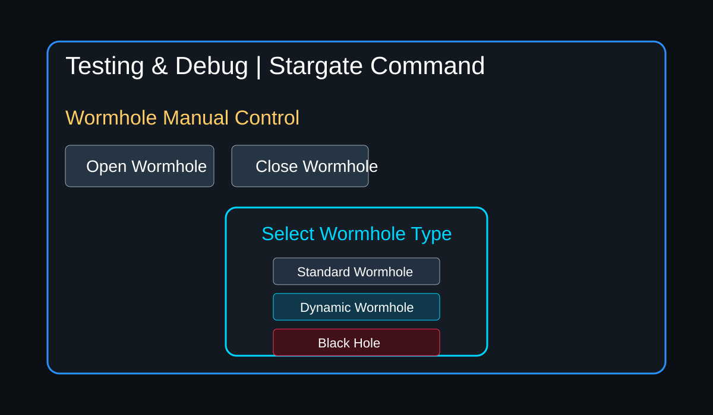
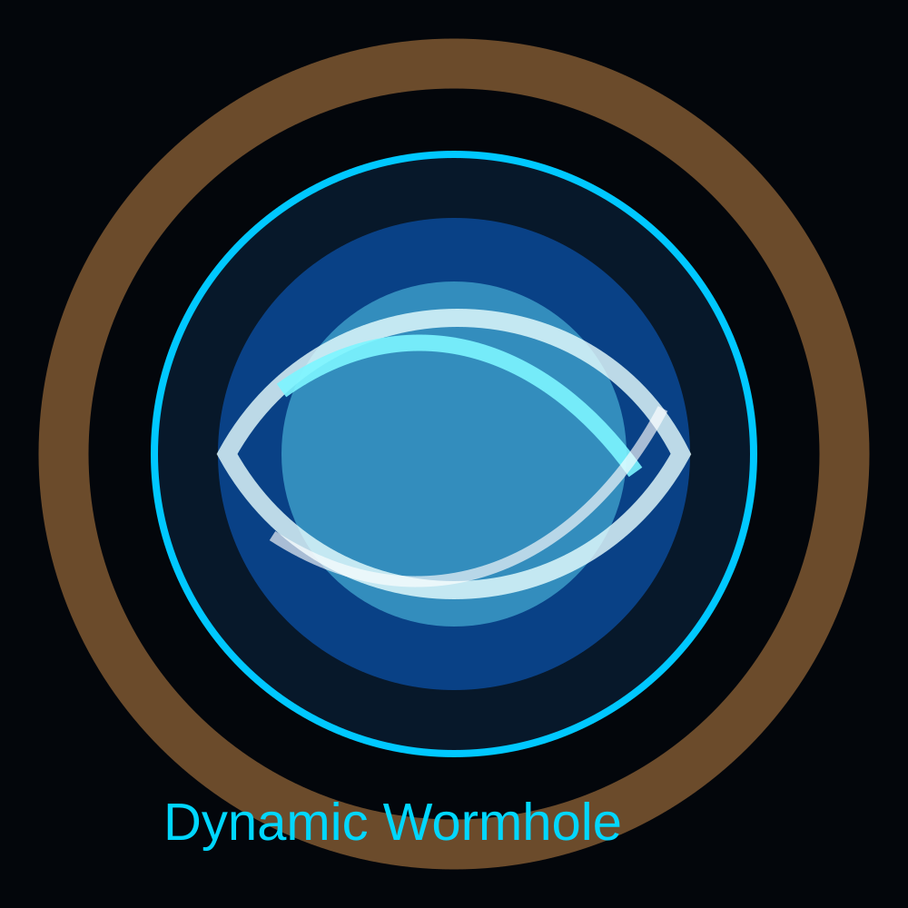
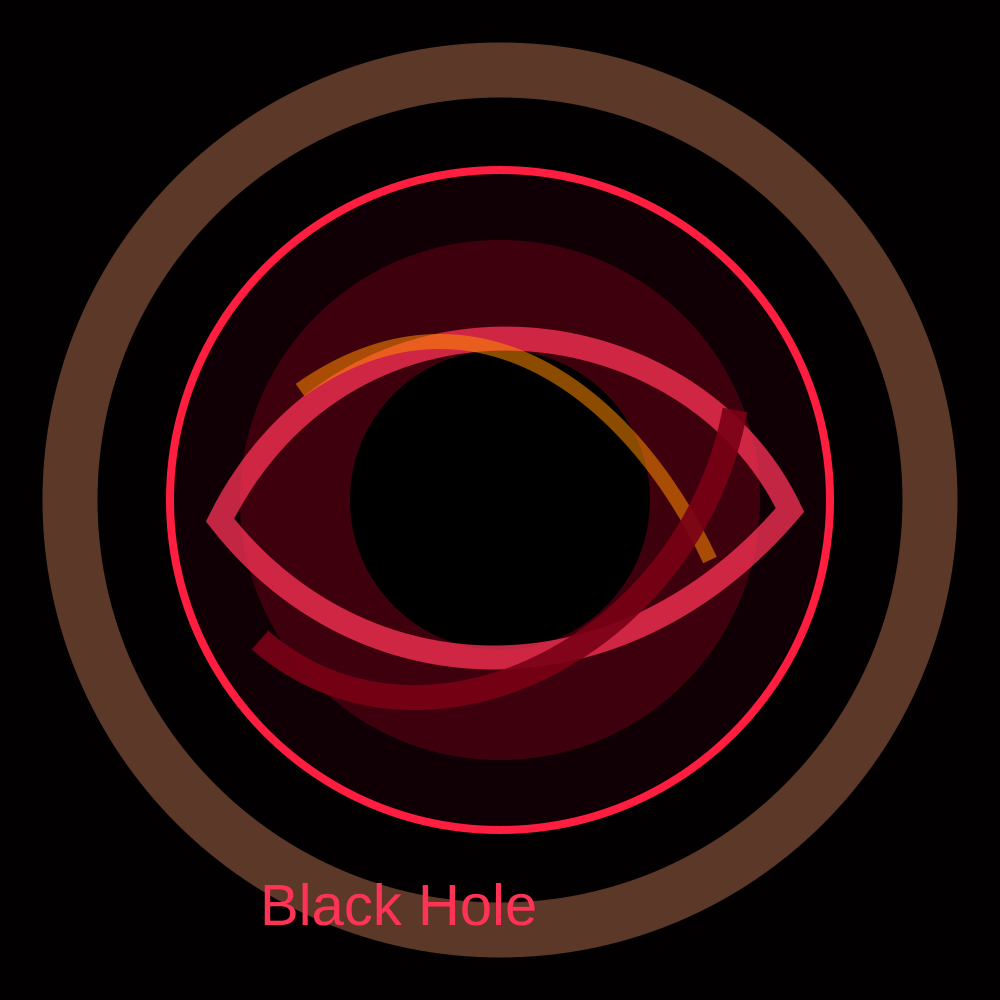

# SG1 Dynamic Wormhole Patch

A lightweight Dynamic Wormhole add-on for **Kristian’s Stargate Project SG1 v4**.

This patch adds a live procedural wormhole animation for NeoPixel wormhole LEDs, plus a clean Debug UI workflow:

**Open Wormhole → popup selection → Standard / Dynamic / Black Hole**

It is designed to work on both clean SG1 v4 installs and modified images without replacing the whole web interface.

---

## Features

- Dynamic animated wormhole effect
- Dynamic black hole effect
- One **Open Wormhole** button in `debug.htm`
- Popup selector:
  - Standard Wormhole
  - Dynamic Wormhole
  - Black Hole
- Adds config options for:
  - `use_dynamic_wormhole`
  - `use_dynamic_wormhole_for_incoming`
- Creates a full timestamped backup before modifying files
- Does **not** modify TMC2209, stepper, MotorHat, DHD, volume meter, incoming history, retro CSS, or crosshair settings

---

## Screenshots / Preview

### Debug UI popup



### Dynamic Wormhole concept



### Black Hole concept



---

## Installation

Copy the ZIP/repo folder to your Raspberry Pi, then run:

```bash
cd /home/pi
unzip dynamic_wormhole_only_with_config_patch.zip
cd dynamic_wormhole_only_with_config_patch
sudo ./install.sh /home/pi/sg1_v4
sudo systemctl restart stargate.service
```

If installing from a cloned repo:

```bash
cd /home/pi/sg1-dynamic-wormhole
sudo ./install.sh /home/pi/sg1_v4
sudo systemctl restart stargate.service
```

---

## Test

Open:

```text
http://YOUR_PI_IP:8080/debug.htm
```

Click:

```text
Open Wormhole
```

Then select:

```text
Dynamic Wormhole
```

Check logs:

```bash
tail -n 80 /home/pi/sg1_v4/logs/milkyway.log
```

Expected log:

```text
Opening Wormhole! black_hole=False, dynamic=True
```

---

## Files Modified

### Replaced

```text
classes/StargateMilkyWay/wormhole_manager.py
classes/StargateMilkyWay/wormhole_pattern_manager.py
```

These files contain the Dynamic Wormhole and Dynamic Black Hole animation logic.

### Patched in-place

```text
classes/web_server.py
web/debug.htm
config/milkyway-config.json
config/defaults-milkyway/config.json.dist
```

The installer injects only the required lines instead of replacing the full files.

---

## What This Patch Does Not Change

This patch does not change:

- `retro/css/dial.css`
- `retro/css/dial9.css`
- center crosshair / yellow plus / red dot
- TMC2209 parameters
- stepper parameters
- MotorHat configuration
- DHD LED tests
- volume meter
- incoming history
- alarm clock
- retro dial pages

---

## Restore Backup

The installer creates a backup like:

```text
/home/pi/sg1_v4_backup_dynamic_wormhole_only_YYYYMMDD_HHMMSS
```

Restore example:

```bash
sudo systemctl stop stargate.service
sudo rsync -a --delete /home/pi/sg1_v4_backup_dynamic_wormhole_only_YYYYMMDD_HHMMSS/ /home/pi/sg1_v4/
sudo systemctl start stargate.service
```

---

## Recommended Hardware

- Raspberry Pi running SG1 v4
- NeoPixel wormhole LED ring
- Existing SG1 v4 wormhole pixel support

---

## License

This patch is provided as a hobby add-on for Stargate fan projects.  
Use at your own risk and always keep backups.
